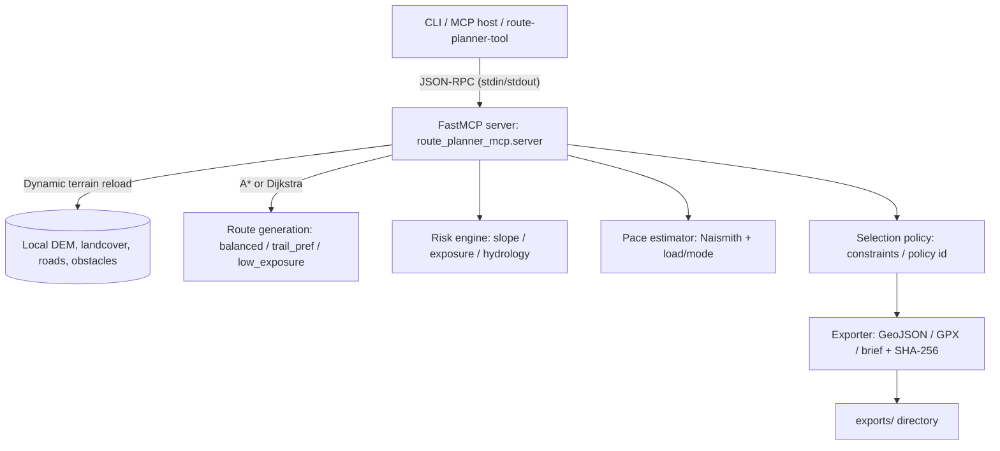

# Route Planner App

Offline mission route planning service, this application exposes MCP-style tools, resources, and prompt metadata so agents can plan, score, and export mission routes without network access.

## Features

- Generates 1–3 candidate routes between two coordinates using local DEM, landcover, road, and obstacle fixtures.
- Dynamically reloads terrain data when switching between uploaded terrain bundles.
- Supports two routing modes: A\* pathfinding on terrain grids (full DEM/landcover) and Dijkstra's algorithm on road networks (OSM-only data).
- Automatically detects OSM-only terrain bundles and switches to road network routing.
- Identifies largest connected road components to ensure viable paths in disconnected graphs.
- Scores each route for slope, exposure, and hydrology factors.
- Provides transparent risk weights/components so commanders can recompute aggregates.
- Reports terrain coverage, hydrology checks, and per-route uncertainty for auditability.
- Includes policy metadata (composite scoring + tie-breakers) and trail coverage summaries for selection audits.
- Estimates travel time with Naismith-based pacing that adapts for load and movement mode (foot/wheeled).
- Applies commander constraints (arrival deadlines, slope caps, distance limits) to select the best option.
- Exports GPX, GeoJSON, and a Markdown mission brief with per-route checksums; includes `@nav/brief` prompt template.
- Surfaces provenance with TTL tracking for local map datasets.
- Offers both JSON-RPC (stdin/stdout) MCP server and a scripted CLI orchestrator.

## Project Layout

```
apps/
  agent/             # FastAPI + LangGraph orchestration service for terrain bundles
  web/               # Next.js frontend with MapLibre visualization
packages/
  route_planner_mcp/ # Offline route planner MCP package (tools, CLI, data fixtures)
```

## Architecture Overview



## Getting Started

### 1. Install dependencies

```bash
python -m venv env
source env/bin/activate
pip install -e packages/route_planner_mcp
# Agent service development (optional, but recommended for the LangGraph API)
pip install -e apps/agent
```

### 2. Run the MCP server

```bash
route-planner-mcp-server
```

The server is implemented with FastMCP and automatically exposes MCP tool metadata following the official guidance.[^fastmcp] Available methods:

- `nav.route`
- `nav.risk_eval`
- `nav.pace_estimator`
- `nav.select`
- `nav.export`
- `@nav/brief` (prompt metadata via `list_prompts`)

### 3. Call an individual tool (no manual JSON required)

Use the helper CLI to handle the JSON-RPC handshake automatically (no need to start the server yourself):

```bash
route-planner-tool nav.route --args '{"start":[34.001,-116.999],"end":[34.008,-116.992],"max_candidates":3}'
```

Swap `nav.route` for any other tool (e.g. `nav.risk_eval`, `nav.export`) and adjust `--args` to match the required parameters.

Call other tools the same way:

```bash
# Evaluate risk for specific routes (IDs returned by nav.route)
route-planner-tool nav.risk_eval --args '{"route_ids":["route-1","route-2"]}'

# Estimate pace for cached routes (omit route_ids to use all)
route-planner-tool nav.pace_estimator --args '{"mode":"foot","load_kg":20,"route_ids":["route-1","route-2"]}'

# Select the preferred route under commander constraints
route-planner-tool nav.select --args '{
  "route_ids":["route-1","route-2"],
  "prefer_low_risk": true,
  "avoid_slope_degrees": 12,
  "max_distance_m": 1500
}'

# Export the chosen route bundle (call nav.select first)
route-planner-tool nav.export --args '{"basename":"mission-blue"}'
```

> Tip: Do **not** run `route-planner-mcp-server` in the same terminal while using `route-planner-tool`. The helper spawns and shuts down the FastMCP server behind the scenes for each call.

### Alternative: Launch via MCP CLI

If you prefer to run through the `mcp` helper (which takes care of the JSON-RPC handshake), use:

```bash
source env/bin/activate
mcp run route-planner-mcp-server.py
```

That adapter script simply calls the same FastMCP app, so the JSON responses are identical.

### 4. Use the planner CLI

The CLI orchestrates `route → risk → pace → select → export`.

```bash
route-planner-cli \
  --start 34.001 -116.999 \
  --end 34.008 -116.992 \
  --mode foot \
  --load-kg 20 \
  --export-name mission-red
```

Outputs include pace/risk summaries (with weighting breakdown) and relative export paths with SHA-256 checksums rooted at `exports/`.

Responses also carry a `schema` fingerprint, EPSG:4326 CRS metadata, and an explicit `waypoints_in_gpx` flag confirming checkpoint parity in device exports.

Call `nav.export` directly (or supply `--export-name`) to choose the basename for generated `*.geojson`, `*.gpx`, and brief files; defaults to the selected route id.

## Agent API (FastAPI + LangGraph)

The orchestration service lives in `apps/agent`. It currently wires a terrain loader and the MCP engine into a LangGraph state machine.

```bash
source env/bin/activate
uvicorn agent_app.main:app --app-dir apps/agent/src --reload
# API available at http://localhost:8000/docs
```

> The agent uses an Ollama-served model for mission reasoning. Make sure the Ollama daemon
> is running and the model is available, for example:
>
> ```bash
> ollama run llama3.1:8b  # downloads on first execution
> ```
>
> Override defaults with `ROUTE_AGENT_OLLAMA_MODEL` and `ROUTE_AGENT_OLLAMA_BASE_URL`.

Environment variables (via `.env` or shell) control storage locations:

- `ROUTE_AGENT_DATA_ROOT` – directory that stores uploaded terrain bundles (default `var/data`)
- `ROUTE_AGENT_EXPORT_ROOT` – directory for generated exports (default `var/exports`)
- `ROUTE_AGENT_OLLAMA_BASE_URL` – Ollama server URL (default `http://localhost:11434`)
- `ROUTE_AGENT_OLLAMA_MODEL` – model identifier used for decisions (default `llama3.1:8b`)
- `ROUTE_AGENT_CORS_ALLOW_ORIGINS` – JSON array or comma-separated origins allowed for CORS (defaults to `http://localhost:3000` and `http://127.0.0.1:3000`)

## Web UI (Next.js scaffold)

A Next.js App Router project lives in `apps/web`. It renders a dark-themed MapLibre canvas with CartoDB Dark Matter base tiles and interactive route visualization.

```bash
pnpm install
NEXT_PUBLIC_AGENT_URL=http://localhost:8000 pnpm dev:web
# open http://localhost:3000
```

The UI features:

- Dark mode map with CartoDB Dark Matter tiles and custom label styling
- Real-time route visualization with color-coded paths (primary route in green, alternatives in blue)
- Interactive form for terrain selection, coordinates, and routing preferences
- Route analysis table showing distance, cost, and terrain coverage
- LLM-generated mission assessment and recommendations
- Progress indicators for terrain upload and route planning
- Support for uploading OSM PBF files with real-time conversion progress

The UI depends on the FastAPI agent service (under `apps/agent`) for terrain bundle ingestion and MCP orchestration.

### Uploading Terrain Data

The UI supports uploading terrain bundles in multiple formats:

**Option 1: Complete Terrain Bundle (.zip)**

- Package containing all 4 required files:
  - `dem.json` (elevation data)
  - `landcover.json` (terrain classification)
  - `roads.geojson` (road network)
  - `obstacles.geojson` (hazards/obstacles)

**Option 2: OpenStreetMap Data (.osm.pbf)**

- Upload OSM PBF files directly from [Geofabrik](https://download.geofabrik.de/)
- System automatically extracts roads and obstacles using pyosmium
- DEM and land cover are created as placeholders (10x10 grid)
- Routes are computed using Dijkstra's algorithm on the road network graph
- System identifies the largest connected component to ensure viable paths
- No additional system dependencies required

**Option 3: Use Demo Data**

- Demo terrain bundles are available in `var/data/` after setup

## Docker Compose

Bring up the agent API and web UI together:

```bash
docker compose up --build
```

The agent listens on `http://localhost:8000`, and the web UI is served at `http://localhost:3000`. The containerised web app targets the agent service via the Docker network (`http://agent:8000`).

## Prompt Metadata

`@nav/brief` is exposed via `list_prompts`. Agents can request the template to compose Markdown mission briefs summarizing checkpoints, timing, and risk caveats.

## Data Provenance & TTLs

Each tool response exposes dataset freshness. DEM and landcover expire after 30 days. Agents should re-run planning steps if TTL flags appear expired.

## Development

- **Lint & format (Python):**
  - `ruff check packages/route_planner_mcp apps/agent/src`
  - `black packages/route_planner_mcp apps/agent/src`
- **Lint (web):** `pnpm lint:web`
- **Run tests:** `pytest` (tests to be added)
- Update fixtures in `packages/route_planner_mcp/data/` to reflect new AOIs or intelligence; keep metadata timestamps current to pass TTL checks.

[^fastmcp]: Based on the “Build an MCP server” guide.[Model Context Protocol – Build an MCP server](https://modelcontextprotocol.io/docs/develop/build-server)
